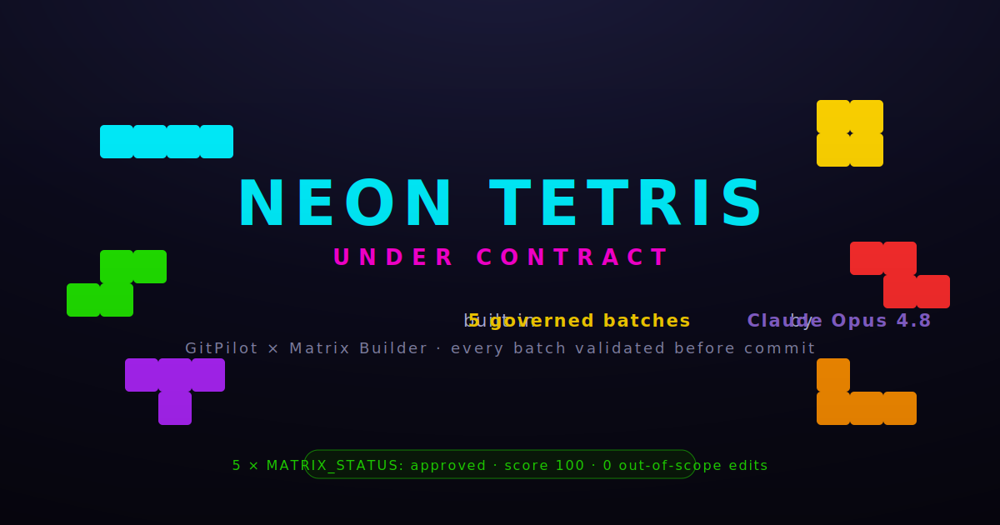
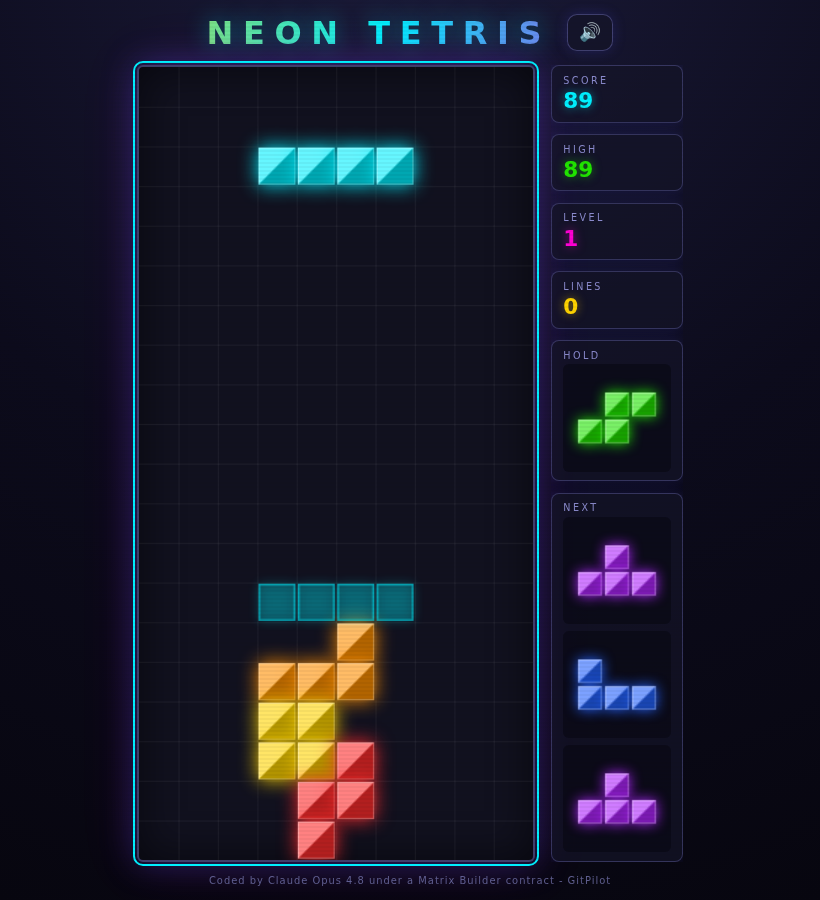

<div align="center">

# 🟦🟨🟪 Neon Tetris — Under Contract

### A full, colorful Tetris an AI wrote across **5 governed batches** — under contract, with proof.

**Claude Opus 4.8**, driven by **[GitPilot](https://gitpilot.ruslanmv.com)**, built this game one batch at a time — each batch bound by a **[Matrix Builder](https://github.com/agent-matrix/matrix-builder)** contract (allow-list: `frontend/index.html` only) and validated by `mb check` **before** it could land. Five batches, five `approved` Matrix Commits.

[](https://ruslanmv.github.io/tetris-under-contract/)
&nbsp;
[](EVIDENCE.md)

[](EVIDENCE.md)
[](https://github.com/ruslanmv/gitpilot)
[](https://github.com/agent-matrix/matrix-builder)
[](LICENSE)



</div>

---

## 🎮 [Play it → ruslanmv.github.io/tetris-under-contract](https://ruslanmv.github.io/tetris-under-contract/)



One self-contained HTML file. No install, no build. Desktop **and** mobile.

**Controls:** ← → move · ↑/X rotate CW · Z rotate CCW · ↓ soft drop · **Space** hard drop · **C/Shift** hold · **P/Esc** pause.
**Touch:** on-screen buttons + swipe gestures.

Features: 7-bag randomizer · **SRS rotation with wall kicks** · ghost piece · hold + next preview · line-clear particles & flash · level/speed curve · **WebAudio** SFX (mute toggle) · high score (localStorage) · start / pause / game-over screens · neon CRT styling.

---

## The point: an AI built something *real* — and stayed in scope the whole way

This isn't a toy snippet. It's a complete Tetris (~56 KB) that **Claude Opus 4.8 wrote**, and
every step is **auditable** ([`EVIDENCE.md`](EVIDENCE.md)). What makes it trustworthy isn't a promise —
it's that each batch was bound by a contract it could not exceed, and a validator (`mb check`),
not vibes, decided whether the result could ship. The model touched **only** `frontend/index.html`,
every single batch.

## How it was built — 5 batches, each under contract

Each batch ran the same loop: `mb next` (plan a scoped batch) → `mb prompt --coder gitpilot`
(render the contract) → `gitpilot generate` with **Claude Opus 4.8** (extend the file) →
`mb check` (validate, fail-closed) → an immutable Matrix Commit.

| # | Batch | What Opus added | Size | Matrix Commit |
|---|---|---|---|---|
| 1 | Foundation | 10×20 board, 7 colored tetrominoes, render loop, gravity, lock, 7-bag | 11 KB | `mc-e5da1ec40b74` |
| 2 | Controls + rotation | move/soft/hard drop, **SRS rotation + wall kicks**, lock delay, DAS | 20 KB | `mc-ed8f08a81d49` |
| 3 | Lines + scoring | line clears, scoring, levels/speed, **next** preview, **hold** | 28 KB | `mc-1e2903a575aa` |
| 4 | Juice | ghost piece, particles + flash, **WebAudio** SFX, mobile touch, responsive | 44 KB | `mc-11c9835f1a93` |
| 5 | States + polish | start/pause/game-over, **high score** (localStorage), a11y, credit | 56 KB | `mc-c186f714b6a1` |

```text
$ mb timeline
Tetris Under Contract  v1.0.0
  Batch 01  Foundation                         ✓ mc-e5da1ec40b74
  Batch 02  Controls and SRS rotation          ✓ mc-ed8f08a81d49
  Batch 03  Line clears, scoring, levels …      ✓ mc-1e2903a575aa
  Batch 04  Juice: ghost, particles, sound …    ✓ mc-11c9835f1a93
  Batch 05  Game states, high score, polish     ✓ mc-c186f714b6a1
```

Every batch returned `MATRIX_STATUS: approved score=100`. Full transcript in [`EVIDENCE.md`](EVIDENCE.md).

## The loop (real commands)

```bash
pip install agent-generator gitcopilot crewai
export GITPILOT_PROVIDER=claude GITPILOT_CLAUDE_MODEL=claude-opus-4-8 ANTHROPIC_API_KEY=sk-ant-…

mb init "A polished neon Tetris … single self-contained HTML file" --quality standard
for batch in foundation controls scoring juice states; do
  mb next "$batch"                                   # plan a scoped batch
  mb prompt --coder gitpilot                         # render the contract
  gitpilot generate -m "$(cat coder-prompts/gitpilot.md) + current file + batch spec" -o .
  mb check frontend/index.html                       # validate, fail-closed
done
```

## What's in this repo

```
tetris-under-contract/
├── frontend/index.html   ← the whole game, written by Claude Opus 4.8 (the only file it could touch)
├── EVIDENCE.md           ← the 5-batch run: provider, model, sizes, verdicts, commits
├── coder-prompts/gitpilot.md   ← the final batch's contract-bound prompt
├── .gitpilotrules        ← repo guardrails for the coder
├── .mb/                  ← the Matrix Bundle: blueprint + 5 batches + 5 commits
├── .github/workflows/contract.yml   ← CI: re-runs `mb check`, then deploys to Pages
└── README.md
```

## Links

- 🧩 **Matrix Builder** → [agent-matrix/matrix-builder](https://github.com/agent-matrix/matrix-builder)
- 🚁 **GitPilot** → [gitpilot.ruslanmv.com](https://gitpilot.ruslanmv.com)
- ⚙️ **Engine + `mb` CLI** → [ruslanmv/agent-generator](https://github.com/ruslanmv/agent-generator)
- 🕹️ **Also:** [Pong, under contract](https://github.com/ruslanmv/pong-under-contract)

---

<div align="center">

*Five batches. One file. Zero out-of-scope edits. ⭐ if that's how AI should ship code.*

Built by [Ruslan Magana Vsevolodovna](https://ruslanmv.com) · MIT licensed

</div>
